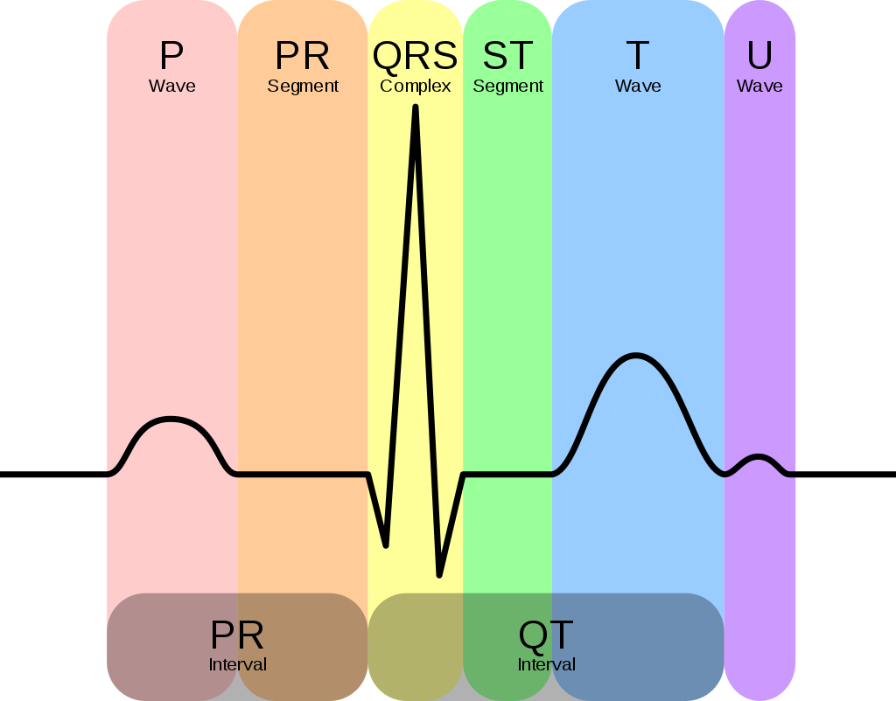
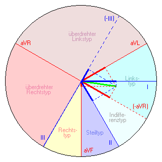

ECG [](https://www.paypal.com/cgi-bin/webscr?cmd=_s-xclick&hosted_button_id=EFQXNQ7UYXYKW&source=url)
=======

[ECG](https://github.com/thierrygrimm/ECG) provides different resources to evaluate electrocardiogram (ECG) data more streamlined. 


## Organization
### Foundations 

**What is an electrocardiogram?**
 An electrocardiogram is a graph of voltage versus time of the electrical activity of the heart using differently placed electrode (conductive pads) configurations also called leads. They detect muscle depolarization and repolarization during each cardiac cycle. It can help diagnose cardiac rhythm disturbances, inadequate coronary artery blood flow or electrolyte disturbances.


**How can it be interpreted?**
Interpretation of the ECG is ultimately that of pattern recognition.
A typical caridac rhythm produces four entities – a P wave, a QRS complex, a T wave, and a U wave. One pass is initiated by pacemaker cells in the sinoatrial node. The electrical depolarization spreads through the atria, the atrioventricular node, the His bundle, Purkinje fibers and the ventricles.

<p align="center">
  
</p>


## Sections
### Axial Deviation

The hexaxial reference system also known as the Cabrera system is a convention to present the extremity leads of an electrocardiogram (ECG). It can determine the projected vector of a heart's electrical axis onto the frontal plane.

<p align="center">
  
</p>

Different types of axial deviation types are attributed to different amplitudes and directions of the R-peaks.

<p align="center">
  
</p>

By adding R-peak amplitude weighted vectors of leads in the Cabrera circle one can quantitatively determine the heart's electrical axis on the frontal plane. By inputting those relative values the notebook calculates the according vector: 
[ECG Hexaxial Reference System](https://github.com/thierrygrimm/ECG/blob/main/ECG%20Hexaxial%20Reference%20System.ipynb)


## Issues

Found a bug? Want more features? Find something missing in the documentation? Let me know! Please don't hesitate to [file an issue](https://github.com/thierrygrimm/ECG/issues/new) and make a recommendation.

## License
```
ECG - Resources to evaluate ECG data

The MIT License (MIT)

Copyright (c) 2020 Thierry Grimm

Permission is hereby granted, free of charge, to any person obtaining a copy
of this software ("ECG") and associated documentation files (the "Software"), to deal
in the Software without restriction, including without limitation the rights
to use, copy, modify, merge, publish, distribute, sublicense, and/or sell
copies of the Software, and to permit persons to whom the Software is
furnished to do so, subject to the following conditions:

The above copyright notice and this permission notice shall be included in
all copies or substantial portions of the Software.

THE SOFTWARE IS PROVIDED "AS IS", WITHOUT WARRANTY OF ANY KIND, EXPRESS OR
IMPLIED, INCLUDING BUT NOT LIMITED TO THE WARRANTIES OF MERCHANTABILITY,
FITNESS FOR A PARTICULAR PURPOSE AND NONINFRINGEMENT. IN NO EVENT SHALL THE
AUTHORS OR COPYRIGHT HOLDERS BE LIABLE FOR ANY CLAIM, DAMAGES OR OTHER
LIABILITY, WHETHER IN AN ACTION OF CONTRACT, TORT OR OTHERWISE, ARISING FROM,
OUT OF OR IN CONNECTION WITH THE SOFTWARE OR THE USE OR OTHER DEALINGS IN
THE SOFTWARE.
```
